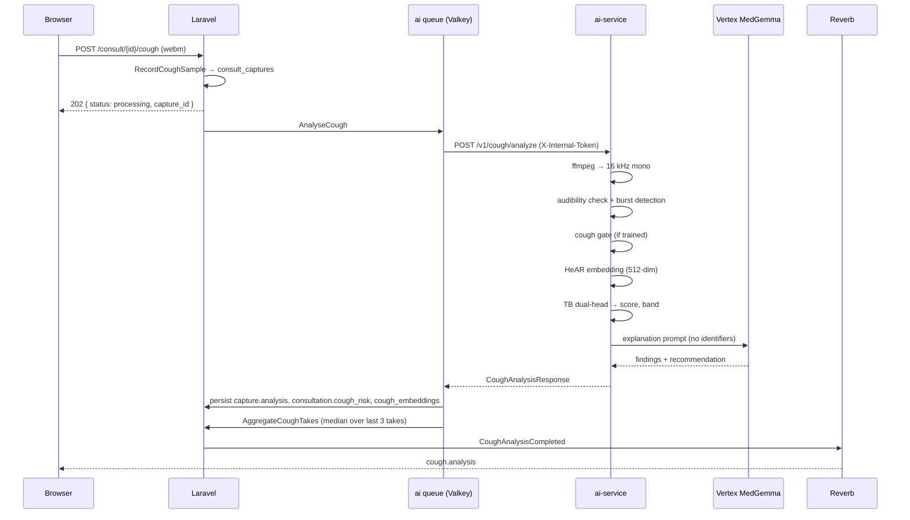
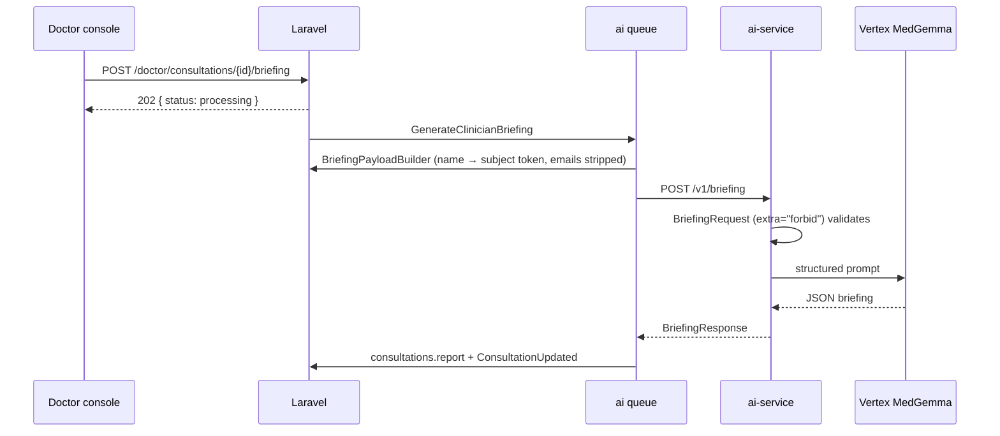

# AI Pipeline

Two clinical pipelines run behind `ai-service/`: **cough screening** and
**clinician briefing**. A third model — Gemini Live — runs in the browser and is
deliberately excluded from both.

## What runs where

| Model                                               | Where it runs            | What it is allowed to do                              |
| --------------------------------------------------- | ------------------------ | ----------------------------------------------------- |
| Gemini Live (`gemini-3.1-flash-live-preview`)       | Google, from the browser | Speech in/out, transcripts, barge-in, camera presence |
| HeAR (`google/hear-pytorch`)                        | Local, `ai-service`      | Cough audio → 512-dim health acoustic embedding       |
| TB dual-head (`sach3v/Domain_aware_dual_head_HEar`) | Local, `ai-service`      | Embedding → TB risk score                             |
| Cough gate (locally trained)                        | Local, `ai-service`      | Reject non-cough audio before scoring                 |
| EmbeddingGemma (`google/embeddinggemma-300m`)       | Local, `ai-service`      | Text embeddings for recall/similarity                 |
| MedGemma (`medgemma-4b-it`)                         | Vertex AI Model Garden   | Plain-language explanation, clinician briefing        |

Gemini never sees cough audio, a risk score, or a briefing. That is an
architectural rule, not a configuration choice — see
[ARCHITECTURE.md](ARCHITECTURE.md).

## Cough screening



### 1. Decode

Any upload is decoded with ffmpeg to **16 kHz mono**, the sample rate HeAR
expects (`ai-service/app/services/audio.py`). Uploads above `MAX_UPLOAD_MB`
(default 25) are rejected; the Laravel side caps cough uploads at 8 MB first.

### 2. Audibility and burst detection

`ensure_audible()` rejects near-silence by RMS floor. `detect_cough_bursts()`
then looks for sustained loud events using an adaptive threshold
(`median + K × MAD`, floored at a minimum RMS). A recording with no audible
event returns `unclear` without ever loading a model — the TB classifier was
trained on real coughs, so scoring room tone would be inventing a number.

### 3. Cough gate (recommended)

Speech has sustained energy and passes the loudness check, but the TB head never
saw speech in training and will answer with a spurious risk. The gate is a small
classifier over the HeAR embedding that answers "is this a cough?" first.

Train it on your own clips:

```bash
cd ai-service
mkdir -p data/gate/cough data/gate/other
# cough/: 5+ forced coughs.  other/: 5+ speech and room-noise clips.
uv run scripts/train_cough_gate.py --cough-dir data/gate/cough --other-dir data/gate/other
```

This writes `models/cough_gate.joblib`, which is gitignored — it encodes
personal voice characteristics and must not be committed or shared. Tune with
`COUGH_GATE_THRESHOLD` (probability of "cough", default `0.5`).

Without a trained gate the service logs a note, skips the check, and reports
`cough_gate.loaded: false`. In that state, treat any result from non-cough audio
as meaningless.

### 4. HeAR embedding

`hear_preprocess.py` reimplements HeAR's expected front end: framed STFT with a
Hann window, mel filterbank, PCEN, and a bilinear resize matched to the
TensorFlow reference. Input is a fixed 2-second clip (`CLIP_SAMPLES = 32000` at
16 kHz); shorter audio is padded. Output is a 512-dimension embedding.

The same embedding is stored in `cough_embeddings` for acoustic similarity
search, so "similar cases" in the doctor console is a byproduct of screening
rather than a second inference pass.

### 5. TB classification

The dual-head classifier scores the embedding, and the score maps to a band
(`ai-service/app/services/tb_classifier.py`):

| Band     | Score  |
| -------- | ------ |
| `high`   | ≥ 0.66 |
| `medium` | ≥ 0.55 |
| `low`    | < 0.55 |

The medium floor was narrowed from the upstream 0.33 because the wider band
overcalled genuinely low-risk samples. It trades sensitivity for specificity and
should be revalidated on a real cohort before any clinical use.

`RiskLevel::fromScore()` in PHP mirrors these cutoffs
(`app/Domain/Consult/Enums/RiskLevel.php`). **Change both or neither.**

### 6. Explanation

MedGemma turns the band, score, and duration into two short clinician-readable
strings — `findings` and `recommendation`. The prompt carries no identifiers,
and `redact_identifiers()` strips emails and phone numbers from free text before
it leaves the host (`ai-service/app/services/vertex.py`).

Without a Vertex endpoint, a template explanation is used instead. The result
still carries the real score and band — only the prose is templated.

### 7. Aggregation across takes

Patients are asked to cough more than once. `AggregateCoughTakes` takes the
**median score over the last three scored takes**, which stops a single unlucky
recording from setting the consultation's risk. Rules:

- One scored take (or none) passes through unchanged.
- `unclear` takes carry no score and never move the median.
- The representative take — score closest to the median, newest on ties —
  supplies the human-readable findings.

### 8. Persistence and broadcast

`AnalyseCough` writes `consult_captures.analysis`, `consultations.cough_analysis`
and `cough_risk`, upserts `cough_embeddings`, records a `cough.analysed` audit
entry (band, duration, model availability — no clinical prose), and fires
`CoughAnalysisCompleted`.

Job characteristics: queue `ai`, `tries = 3`, `timeout = 300s`, backoff
`[10, 60, 180]`. On final failure, `failed()` still persists an `unanalysed`
result and still broadcasts — the UI is never left spinning.

## Clinician briefing



The payload is `subject_token`, `age`, `sex`, `risk_factors`, `transcript`, and
a `cough` summary — nothing else can be sent, because the Pydantic model forbids
extra fields. A payload that accidentally contained `name` or `email` would be a
422, not a leak.

The response is structured: chief complaint, history, risk factors, cough
findings, suggested questions, red flags, disclaimer. MedGemma output is parsed
as JSON, with a repair prompt on malformed output and a template fallback if
that fails too. Template briefings are marked `degraded: true`, and the doctor
console shows that state rather than hiding it.

Job characteristics match `AnalyseCough`: queue `ai`, `tries = 3`,
`timeout = 300s`, backoff `[10, 60, 180]`.

## Degradation summary

| Condition                         | Result                                                 |
| --------------------------------- | ------------------------------------------------------ |
| No `ml` extras or no weights      | `unclear`, `/v1/health` → `degraded`                   |
| Near-silent or no burst detected  | `unclear`, no model invoked                            |
| Gate trained and sample rejected  | `unclear`                                              |
| Gate not trained                  | Gate skipped, `cough_gate.loaded: false`               |
| No `VERTEX_ENDPOINT_ID`           | Fake mode, template prose, `vertex.mode: "fake"`       |
| Vertex error or unparsable output | Repair prompt, then template, `degraded: true`         |
| `ai-service` down                 | Retries with backoff, then `unclear` — still broadcast |

## Clinical status

This is a **screening aid**, not a diagnostic device. Nothing here is cleared or
approved by a medical regulator. The TB thresholds above were tuned on limited
data and need validation against microbiological reference standards before any
deployment that affects patient care. Every patient-facing result carries a
disclaimer and a recommendation to seek an in-person clinical assessment.
