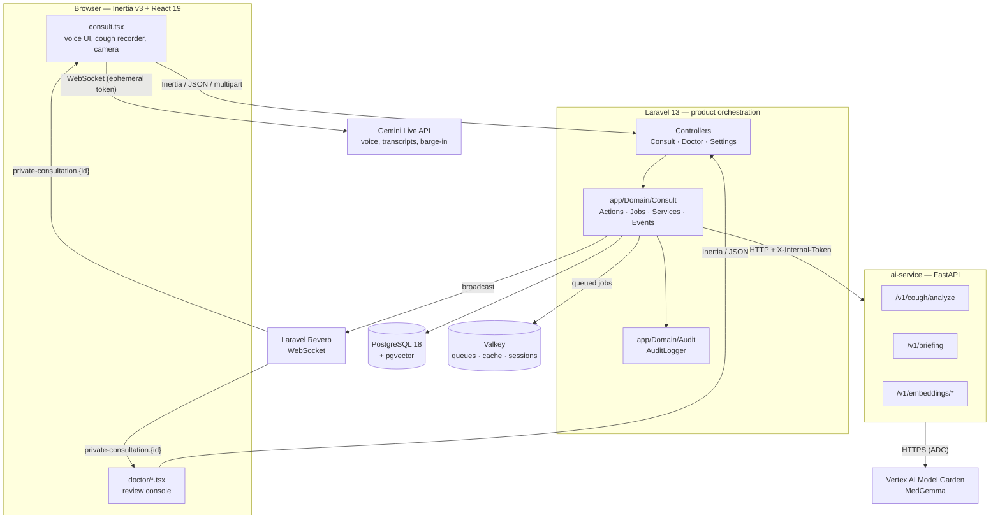

# Architecture

Respir is two applications and one browser SPA that talk over well-defined
boundaries: a Laravel product backend, a Python clinical inference service, and
an Inertia/React frontend. The split exists for one reason — clinical inference
and patient identifiers must stay inside the clinic network, while the realtime
voice experience needs a hosted model.

## System overview



## The boundaries

These are not style preferences. They are enforced in code and covered by tests.

### 1. Gemini is interaction-only

The Gemini Live API handles speech in, speech out, transcripts, barge-in, and
camera presence. It never decides anything clinical. Cough analysis, TB risk
scoring, clinical explanations, and clinician briefings run through
`ai-service/` only.

Practically: `ConsultationController::liveToken()` mints a short-lived Gemini
token for the browser, and `ConsultAgent` (built on `laravel/ai`) is the
fallback text path. Neither touches cough audio or produces a risk score.

### 2. Direct identifiers never leave the host

`app/Domain/Consult/Services/BriefingPayloadBuilder.php` replaces the patient
name with a subject token and strips emails before any payload is built. The
Python side refuses anything identifying structurally: `BriefingRequest` is a
Pydantic model with `extra="forbid"`, so an unknown field — including a stray
`name` or `email` — is a 422, not a silent pass-through.

### 3. Cough analysis is asynchronous

`POST /consult/{consultation}/cough` stores the recording and returns **202
Accepted**. The work happens in the `AnalyseCough` job on the `ai` queue. The
result reaches the browser as the `cough.analysis` Reverb event. Nothing reads
an analysis result out of that HTTP response, because there is none.

### 4. Every patient-data access is audited

`AuditLogger::record()` writes an append-only row for doctor views, capture
downloads, consent, live-session starts, briefing requests, and completed
external AI calls. Audit context carries actors, subjects, destinations, and
IPs — never clinical content.

## Layers

| Layer              | Technology                                                          | Responsibility                                             |
| ------------------ | ------------------------------------------------------------------- | ---------------------------------------------------------- |
| Frontend           | Inertia v3, React 19, TypeScript, Tailwind CSS 4, Vite 8, Wayfinder | Patient consult room, doctor console, landing page         |
| Realtime voice     | Gemini Live API (`gemini-3.1-flash-live-preview`)                   | Speech, transcripts, barge-in, tool calling                |
| Realtime push      | Laravel Reverb + `@laravel/echo-react`                              | Cough results and consultation updates; no polling         |
| Backend            | Laravel 13, PHP 8.5                                                 | Auth, consent, consultations, queues, broadcasting, audit  |
| Agent SDK          | `laravel/ai`                                                        | `ConsultAgent` — Sage's turn logic and fallback chat       |
| Clinical inference | Python 3.12, FastAPI, uvicorn                                       | One token-authenticated boundary for all clinical AI       |
| Audio ML           | HeAR embeddings, TB dual-head classifier, cough gate                | Cough → 512-dim embedding → risk score                     |
| Text embeddings    | EmbeddingGemma                                                      | Similarity search support                                  |
| Clinical LLM       | MedGemma on Vertex AI                                               | Plain-language explanation and clinician briefing          |
| Data               | PostgreSQL 18 + pgvector (HNSW cosine)                              | Records plus vector similarity over cough embeddings       |
| Queue & cache      | Valkey (Redis-compatible)                                           | `ai` queue for inference, `default` queue, cache, sessions |
| Audio decode       | ffmpeg                                                              | Any upload → 16 kHz mono                                   |
| Auth               | Laravel Fortify                                                     | Login, registration, reset, verification                   |

## Code map

```
app/
├── Ai/Agents/ConsultAgent.php      Sage's turn-based conversation logic
├── Domain/
│   ├── Audit/                      AuditLogger + AuditAction enum
│   └── Consult/
│       ├── Actions/                StartConsultation, RecordCoughSample,
│       │                           AggregateCoughTakes, FindSimilarCoughs,
│       │                           SaveSessionTranscript, RecallConversationContext,
│       │                           QueueSummary
│       ├── DTOs/                   CoughAnalysisResult, ClinicianBriefing,
│       │                           TranscriptTurn, VoiceTurnResult
│       ├── Enums/                  RiskLevel, ConsultationStatus
│       ├── Events/                 CoughAnalysisCompleted, ConsultationUpdated
│       ├── Jobs/                   AnalyseCough, GenerateClinicianBriefing
│       └── Services/               PythonAiClient, BriefingPayloadBuilder
├── Http/
│   ├── Controllers/Consult/        Patient flow
│   ├── Controllers/Doctor/         Review console
│   └── Middleware/                 EnsurePatient, EnsureDoctor, EnsureProfileCompleted
└── Models/                         Consultation, ConsultCapture, ConsultSessionLog,
                                    CoughEmbedding, AuditLog, User

ai-service/app/
├── api/routes/                     health, cough, briefing, embeddings, vision
├── ml/                             device selection, model registry
├── schemas/models.py               request/response contracts (extra="forbid")
├── security.py                     X-Internal-Token enforcement
└── services/                       hear, hear_preprocess, tb_classifier,
                                    cough_gate, text_embeddings, vertex,
                                    explanations, audio

resources/js/
├── pages/consult.tsx               Patient consult room
├── pages/doctor/                   Triage list and consultation review
├── pages/welcome.tsx               Landing page
└── lib/gemini-live.ts              Gemini Live WebSocket client
```

## Request paths

### Patient voice interview

1. `POST /consult` creates a consultation (`StartConsultation`).
2. `POST /consult/{id}/consent` records `consultations.consented_at`. Until this
   exists, voice, cough, and live-token endpoints return **403**.
3. `GET /consult/{id}/live/token` mints an ephemeral Gemini token. The browser
   opens the Live API WebSocket directly with it, so audio streams do not transit
   the Laravel server.
4. `POST /consult/{id}/sessions` persists transcript turns as
   `consult_session_logs` rows.
5. `POST /consult/{id}/voice` is the non-Live fallback: a text or audio turn
   handled by `ConsultAgent`.

### Cough screening

1. `POST /consult/{id}/cough` — `RecordCoughSample` stores the audio as a
   `consult_captures` row, dispatches `AnalyseCough` on the `ai` queue, returns
   **202**.
2. `AnalyseCough` calls `PythonAiClient::analyzeCough()`.
3. `ai-service` decodes with ffmpeg to 16 kHz mono, runs the cough gate, embeds
   with HeAR, scores with the TB dual-head classifier, and asks MedGemma for the
   explanation.
4. Laravel persists the analysis on the capture and the consultation, stores the
   512-dim embedding in `cough_embeddings`, and broadcasts `cough.analysis`.
5. `AggregateCoughTakes` combines multiple takes into the consultation-level risk.

Details and thresholds are in [AI-PIPELINE.md](AI-PIPELINE.md).

### Clinician briefing

1. `POST /doctor/consultations/{id}/briefing` returns **202** and queues
   `GenerateClinicianBriefing`.
2. `BriefingPayloadBuilder` builds a de-identified payload (subject token, age,
   sex, risk factors, transcript, cough summary).
3. `ai-service` `/v1/briefing` calls MedGemma on Vertex AI, or falls back to a
   template briefing marked `degraded: true`.
4. Laravel stores it on `consultations.report` and broadcasts
   `consultation.updated`.

## Failure behavior

The system degrades instead of blocking a consultation.

| Missing / failing          | Behavior                                                                                 |
| -------------------------- | ---------------------------------------------------------------------------------------- |
| Local model weights        | `/v1/cough/analyze` returns `risk_level: "unclear"`; `/v1/health` reports `degraded`     |
| Cough gate not trained     | Gate is skipped with a log note; `cough_gate.loaded: false`                              |
| `VERTEX_ENDPOINT_ID` unset | MedGemma runs in fake mode; `/v1/health` reports `vertex.mode: "fake"`                   |
| Vertex call fails          | Template briefing, `degraded: true`                                                      |
| `ai-service` unreachable   | `AiServiceUnavailable`; the job retries with backoff and finally persists `unclear`      |
| Gemini key missing         | `GET /live/token` returns **503** `gemini_not_configured`; the text fallback still works |

Every failure path still broadcasts a final state, so the UI never waits forever.
